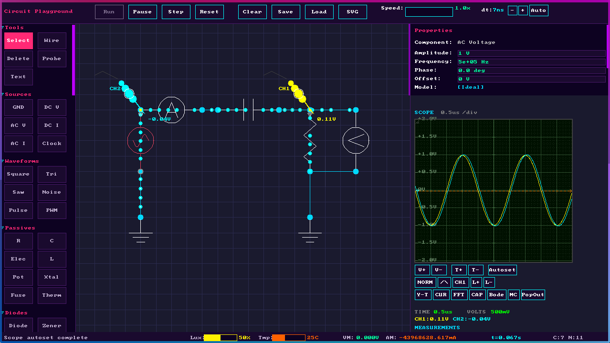
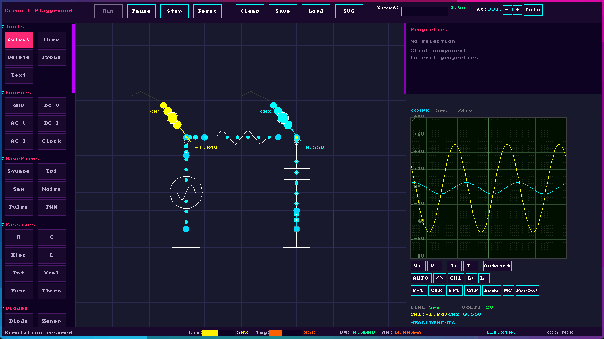
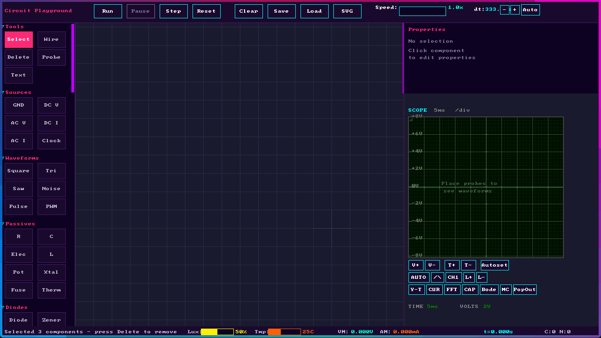
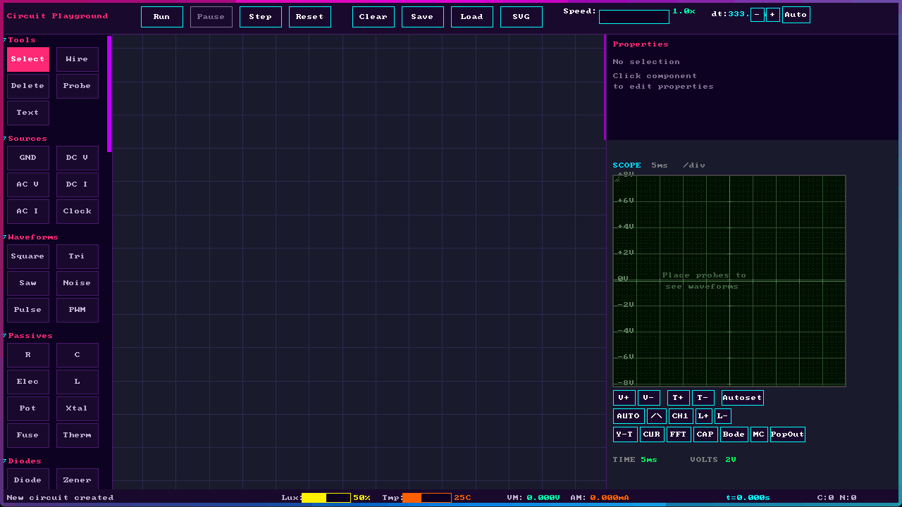
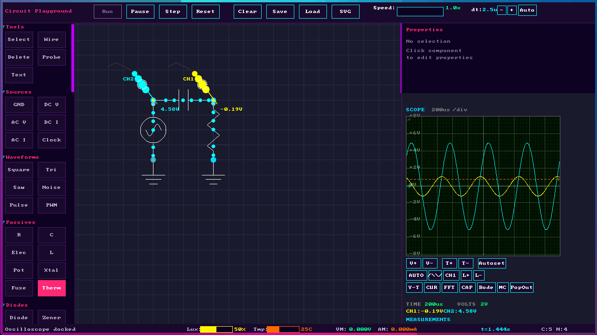
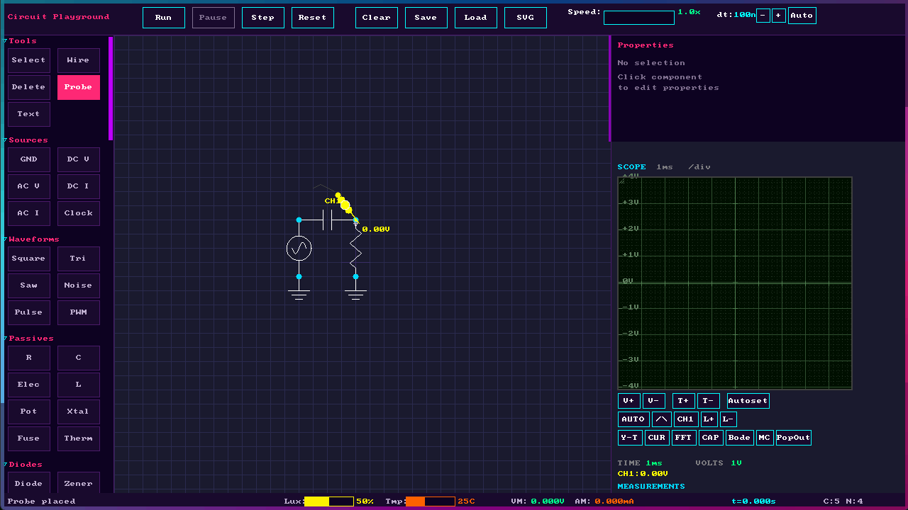

# Circuit Playground Simulator

**Latest Release: [v3.2.2](https://github.com/jfalvarez1/circuit_toy/releases/tag/v3.2.2)**

A native desktop circuit simulator written in C with SDL2, featuring a synthwave-themed interface. Build, simulate, and analyze electronic circuits with an intuitive drag-and-drop interface.





### Spotlight Search (Ctrl+K)



## Features

### Extensive Component Library

**Sources**
- Ground reference
- DC Voltage Source (adjustable voltage, internal resistance)
- AC Voltage Source (amplitude, frequency, phase, DC offset, frequency sweep)
- DC Current Source (adjustable current)
- Square Wave Generator (frequency, duty cycle, rise/fall time)
- Triangle Wave Generator (frequency, amplitude)
- Sawtooth Wave Generator (frequency, amplitude)
- Noise Source (white noise)

**Passive Components**
- Resistor (with optional temperature coefficient)
- Capacitor (with ESR, ESL, leakage resistance models)
- Inductor (with DCR, saturation current models)
- Potentiometer (adjustable wiper position 0-100%)
- Photoresistor (light-dependent resistance)
- Thermistor (NTC with beta model)
- Fuse (with current rating, blow state)
- Transformer (primary/secondary turns ratio)

**Diodes**
- Standard Diode (Shockley equation model)
- LED (multiple colors: red, green, blue, yellow, white)
- Zener Diode (adjustable Vz, Rz)
- Schottky Diode (lower forward voltage)
- Photodiode (light-sensitive)
- Varactor (voltage-variable capacitance)

**Transistors - BJT**
- NPN BJT (Ebers-Moll model, adjustable beta, Is, VAF)
- PNP BJT (complementary to NPN)
- Darlington NPN/PNP pairs

**Transistors - FET**
- N-Channel MOSFET (square-law model, Vth, Kn, lambda)
- P-Channel MOSFET (complementary)
- N-Channel JFET (IDSS, VP parameters)
- P-Channel JFET (complementary)
- N-Channel Enhancement MOSFET
- P-Channel Enhancement MOSFET

**Thyristors**
- SCR (Silicon Controlled Rectifier)
- TRIAC (bidirectional thyristor)
- DIAC (trigger diode)

**Op-Amps**
- Ideal Op-Amp (adjustable gain, GBW, slew rate)
- Real Op-Amp model (input/output impedance, rail voltages)
- Rail-to-rail option

**Controlled Sources**
- VCVS (Voltage Controlled Voltage Source)
- VCCS (Voltage Controlled Current Source)
- CCVS (Current Controlled Voltage Source)
- CCCS (Current Controlled Current Source)

**Switches**
- SPST Switch (single pole, single throw)
- SPDT Switch (single pole, double throw)
- Push Button (momentary)
- Relay (with coil voltage and resistance)

**Logic Gates**
- AND, OR, NOT, NAND, NOR, XOR, XNOR gates
- Adjustable logic levels (V_low, V_high, V_threshold)

**Digital**
- 555 Timer IC (astable/monostable modes)
- 7-Segment Display
- Flip-Flops

**Display & Measurement**
- LED indicators (multiple colors)
- Lamp (power/voltage ratings)
- Voltmeter (virtual)
- Ammeter (virtual)

**Regulators**
- 7805 (5V fixed regulator with IN/OUT/GND terminal labels)
- 7812 (12V fixed regulator)
- LM317 (adjustable regulator with IN/OUT/ADJ terminal labels)
- TL431 (programmable shunt reference with K/A/REF terminal labels)

**Subcircuits**
- Pin Marker (mark nodes as subcircuit pins with customizable names)
- IC Block (user-defined subcircuit/integrated circuit)

**Other**
- Text Annotation (with font size, bold, italic, underline options)
- Voltage Probe (connect to oscilloscope)

### Pre-Built Circuit Templates



Load complete circuit configurations instantly from the Circuits menu:

**Basic Circuits**
- **Voltage Divider** - Basic resistive divider
- **LED with Resistor** - Simple LED driver circuit

**Filters**
- **RC Low-Pass Filter** - First-order RC filter
- **RC High-Pass Filter** - First-order RC high-pass
- **RL Low-Pass Filter** - First-order RL filter
- **RL High-Pass Filter** - First-order RL high-pass
- **Sallen-Key Low-Pass** - Second-order active filter
- **Active Band-Pass Filter** - Op-amp based band-pass
- **Twin-T Notch Filter** - Notch/band-reject filter

**Rectifiers & Power**
- **Half-Wave Rectifier** - Simple diode rectifier
- **Full-Wave Bridge** - Bridge rectifier
- **Center-Tap Rectifier** - Transformer-based rectifier
- **AC-DC Power Supply** - Complete transformer-based supply
- **120V/60Hz to 12V DC** - American-style power supply

**Transistor Amplifiers**
- **Common Emitter** - BJT voltage amplifier
- **Common Source** - MOSFET amplifier
- **Common Drain** - Source follower (buffer)
- **Multistage Amplifier** - Cascaded gain stages
- **Differential Pair** - Matched transistor pair
- **Push-Pull Output** - Complementary output stage
- **CMOS Inverter** - Digital inverter

**Current Circuits**
- **Current Mirror** - BJT current mirror
- **Constant Current Source** - BJT-based current source

**Op-Amp Circuits**
- **Voltage Follower** - Unity-gain buffer
- **Inverting Amplifier** - Negative gain amplifier
- **Non-Inverting Amplifier** - Positive gain amplifier
- **Difference Amplifier** - Subtractor circuit
- **Summing Amplifier** - Voltage adder
- **Integrator** - Op-amp integrator
- **Differentiator** - Op-amp differentiator
- **Transimpedance Amplifier** - Current to voltage converter
- **Instrumentation Amplifier** - Three op-amp precision amplifier
- **Comparator** - Voltage comparator
- **Window Comparator** - Dual-threshold comparator
- **Schmitt Trigger** - Comparator with hysteresis
- **Precision Rectifier** - Full-wave precision rectifier

**Oscillators**
- **Wien Bridge Oscillator** - Sine wave generator

**Voltage References**
- **Zener Reference** - Zener-based voltage reference

### Advanced Oscilloscope



Full-featured virtual oscilloscope with:
- **8 Channels** - Connect multiple voltage probes
- **Adjustable Scales** - Time/div (1µs to 1s), Volts/div (1mV to 100V)
- **Time-Based Display** - Intelligent sample selection based on visible time window, ensuring smooth waveforms at all time/div settings
- **Voltage Scale Labels** - Y-axis shows voltage marks dynamically based on V/div setting
- **Trigger System** (Tektronix-style)
  - Auto, Normal, Single-shot modes
  - Rising, Falling, Both edge triggers
  - Backward edge search for stable display
  - Trigger-centered data capture
  - Adjustable trigger level
  - Per-channel trigger source selection
- **Display Modes**
  - Y-T (voltage vs time)
  - X-Y (Lissajous patterns)
- **Measurement Cursors** - Time and voltage cursors with delta display
- **Waveform Measurements** - Vpp, Vrms, Vavg, frequency, period, duty cycle
- **FFT Analysis** - Frequency spectrum view with THD and SNR
- **Math Channels** - Combine probe signals with operations:
  - Add (A + B), Subtract (A - B), Multiply (A × B), Divide (A / B)
  - Derivative (dA/dt), Integral (∫A dt)
  - Absolute value, Invert, Log, Square root
- **Persistence Mode** - Phosphor-like trace decay for visualizing signal variations
- **Autoset** - Automatic scale adjustment
- **Screenshot** - Save oscilloscope display as BMP
- **Pop-out Window** - Detach oscilloscope to separate resizable window

### Bode Plot Analysis



Frequency response analysis tool:
- Configurable frequency range (1Hz to 1GHz)
- Magnitude plot (dB)
- Phase plot (degrees)
- Cursor for precise measurements
- Automatic frequency sweep

### Monte Carlo Analysis

Statistical tolerance analysis for worst-case design:
- Run up to 1000 iterations with randomized component values
- Gaussian distribution based on component tolerances
- Statistical results: mean, standard deviation, min/max
- 1% and 99% percentile calculations
- Visualize output variation due to component tolerances
- Trigger from "MC" button in oscilloscope toolbar

### Environment Controls

Simulate real-world environmental conditions:
- **Light Level** - Adjust ambient light (0-100%) for photoresistors and photodiodes
- **Temperature** - Adjust ambient temperature (-40°C to +125°C) for temperature-sensitive components
- Sliders in status bar for quick adjustment

### Current Flow Visualization

- **Animated particles** - Cyan dots flow along wires showing current direction
- **Conventional current** - Particles follow conventional current flow (positive to negative)
- **BFS path tracing** - Current flows from voltage/current source positive terminals to ground nodes
- **Series wire uniformity** - All wires in series show the same animation speed
- **Ground path completion** - Current properly flows to ground terminal wires
- **Voltage source handling** - Correct current direction on wires connected to voltage sources
- **Dual source handling** - When two voltage sources meet, current flows toward lower voltage
- **Speed scaling** - Particle speed scales logarithmically with current magnitude
- **Size indication** - Larger currents show larger particles

### Subcircuit Creation (Ctrl+G)

Create reusable subcircuits from your designs:

1. **Place Pin Markers** - Add Pin markers from the palette to nodes that will become subcircuit pins
2. **Set Pin Names** - Configure pin names (e.g., "VCC", "IN", "OUT", "GND") in the properties panel
3. **Select Components** - Select all components including Pin markers
4. **Open Dialog** - Press Ctrl+G to open the subcircuit creation dialog
5. **Auto-Detection** - Pin markers are automatically detected and their names populated in the dialog

### Simulation Engine

- **Modified Nodal Analysis (MNA)** for accurate DC and transient simulation
- **Newton-Raphson iteration** for nonlinear component convergence
- **Backward Euler integration** for capacitors and inductors
- **Adaptive time step** - Automatically adjusts for frequency (50-300 samples/period)
- Adjustable simulation speed (0.1x to 100x real-time)
- Step-by-step simulation mode
- Auto-adjusting time step for high-frequency accuracy

### User Interface


- **Synthwave color theme** - Neon pink, cyan, and purple accents
- **Animated neon border** - Dual smooth chasers flow around window edges with thick glowing bars
- **Spotlight Search (Ctrl+K)** - Quick component search with fuzzy matching, keyboard navigation, and mouse click selection
- **Collapsible palette categories** - Click to expand/collapse component groups
- **Grid-based placement** with snap-to-grid (toggle with 'S')
- **Pan and zoom** - Middle mouse or Shift+drag to pan, scroll to zoom
- **Component rotation** - Double-click or 'R' key (0°, 90°, 180°, 270°)
- **Wire routing** - Click to start wire, click again to route
- **Property editor** - Right panel for adjusting component values
- **Engineering notation** - Supports k, M, G, m, µ, n, p suffixes
- **Resizable panels** - Drag edges to resize oscilloscope and properties
- **Scrollable scope controls** - Mouse wheel scrolls oscilloscope buttons when window is small
- **Status bar** - Shows simulation time, voltmeter/ammeter readings, Lux/Temp sliders, node count, component count
- **Live measurements** - Voltmeter (VM) and Ammeter (AM) readings displayed in status bar

### File Operations

- **Save/Load circuits** - Binary format (.ckt)
- **Auto-save** - Periodic backup during work
- **Circuit templates** - Pre-built example circuits

## Building

### Requirements

- Meson build system (0.60+)
- Ninja build tool
- SDL2 library
- C11 compatible compiler (GCC, Clang, or MSVC)

### Windows (with Meson)

```bash
# Clone the repository
git clone https://github.com/yourusername/circuit-playground.git
cd circuit-playground

# Setup build directory (SDL2 is fetched automatically)
meson setup build

# Build
meson compile -C build

# Run
./build/circuit-playground.exe
```

### Linux

```bash
# Install dependencies (Ubuntu/Debian)
sudo apt-get install meson ninja-build libsdl2-dev

# Setup and build
meson setup build
meson compile -C build

# Run
./build/circuit-playground
```

### macOS

```bash
# Install dependencies
brew install meson ninja sdl2

# Setup and build
meson setup build
meson compile -C build

# Run
./build/circuit-playground
```

## Usage Guide

### Getting Started

1. **Launch the application** - The main window shows a grid canvas with component palette on the left, oscilloscope on the right.

2. **Place components** - Click a component in the left palette, then click on the canvas to place it. Press 'R' to rotate before placing.

3. **Connect with wires** - Select the Wire tool (or press 'W'), click on a component terminal, then click on another terminal to connect them.

4. **Set component values** - Click on a placed component to select it. Use the Properties panel on the right to adjust values (resistance, voltage, frequency, etc.).

5. **Run simulation** - Click the "Run" button in the toolbar or press Space. The oscilloscope will show voltage waveforms from any connected probes.

### Working with the Oscilloscope

1. **Add probes** - Select the Probe tool from the palette and click on a node to measure its voltage.

2. **Adjust scales** - Use the V/div and Time/div buttons, or click on the scale values to adjust manually.

3. **Set trigger** - Choose trigger mode (Auto/Normal/Single), edge (Rising/Falling), and level. Click on a channel to set it as trigger source.

4. **Use cursors** - Enable cursor mode to measure time intervals and voltage differences.

5. **FFT mode** - Toggle FFT to see frequency spectrum of the signal.

### Running Bode Analysis

1. Add an AC voltage source as input and a probe at the output.
2. Click the "Bode" button to open the Bode plot panel.
3. Set frequency range and click "Recalc" to run the analysis.
4. View magnitude and phase response across frequency.

### Tips

- Use **engineering notation** when entering values: 1k = 1000, 4.7u = 4.7µ, 10n = 10 nano
- **Double-click** a component to rotate it
- Press **F1** to see keyboard shortcuts
- **Middle-click and drag** to pan the canvas
- **Scroll wheel** to zoom in/out
- Click category headers in the palette to **collapse/expand** sections

## Keyboard Shortcuts

| Key | Action |
|-----|--------|
| Escape | Cancel current action, return to select tool |
| Delete/Backspace | Delete selected component |
| R | Rotate component (while placing or selected) |
| W | Switch to Wire tool |
| G | Toggle grid visibility |
| S | Toggle snap-to-grid |
| Ctrl+C | Copy selected component |
| Ctrl+X | Cut selected component |
| Ctrl+V | Paste component |
| Ctrl+D | Duplicate selected component |
| Ctrl+S | Save circuit |
| Ctrl+O | Open circuit |
| Ctrl+Z | Undo |
| Ctrl+Shift+Z | Redo |
| Space | Start/pause simulation |
| + / - | Adjust simulation speed |
| Ctrl+K | Open spotlight search |
| Ctrl+G | Open subcircuit creation dialog (with selection) |
| F1 | Show keyboard shortcuts dialog |

## Technical Details

### Circuit Solver

The simulator uses Modified Nodal Analysis (MNA) to solve circuit equations:

1. Build conductance matrix $G$ and current vector $I$
2. Each component "stamps" its contribution to the matrix
3. Solve $Gx = I$ using Gaussian elimination with partial pivoting
4. Iterate with Newton-Raphson for nonlinear components until convergence

### Transient Analysis

For time-domain simulation:
- Capacitors use companion model: $I = C \frac{V - V_{prev}}{\Delta t}$
- Inductors use companion model: $V = L \frac{I - I_{prev}}{\Delta t}$
- Adaptive time step based on highest frequency signal
- 50-300 samples per period for smooth waveforms

### Component Models

- **Diode**: Shockley equation $I = I_s \left( e^{\frac{V}{nV_t}} - 1 \right)$
- **LED**: Diode model with forward voltage drop based on color
- **Zener**: Reverse breakdown with knee resistance $R_z$
- **BJT**: Ebers-Moll model with $\beta$, Early voltage $V_{AF}$, saturation current $I_s$
- **MOSFET**: Square-law model $I_D = K_n(V_{GS} - V_{th})^2$ with cutoff, triode, and saturation regions
- **JFET**: Shockley equation with $I_{DSS}$ and pinch-off voltage $V_P$
- **Op-Amp**: VCVS with gain $A_{OL}$, GBW, slew rate, and rail limiting
- **Thyristor**: Latching behavior with trigger conditions

## File Structure

```
circuit_toy/
├── meson.build              # Meson build configuration
├── README.md                # This file
├── include/                 # Header files
│   ├── types.h              # Common type definitions
│   ├── matrix.h             # Matrix/Vector operations
│   ├── component.h          # Component definitions
│   ├── circuit.h            # Circuit container
│   ├── circuits.h           # Pre-built circuit templates
│   ├── simulation.h         # Simulation engine
│   ├── analysis.h           # Bode plot analysis
│   ├── render.h             # SDL2 rendering
│   ├── ui.h                 # UI system
│   ├── input.h              # Input handling
│   ├── file_io.h            # File I/O
│   └── app.h                # Main application
├── src/                     # Source files
│   ├── main.c               # Entry point
│   ├── app.c                # Application logic
│   ├── matrix.c             # Linear algebra
│   ├── component.c          # Component implementation
│   ├── circuit.c            # Circuit management
│   ├── circuits.c           # Circuit template implementations
│   ├── simulation.c         # Simulation engine
│   ├── analysis.c           # Bode plot and frequency analysis
│   ├── render.c             # SDL2 rendering
│   ├── ui.c                 # UI rendering
│   ├── input.c              # Input handling
│   └── file_io.c            # File save/load
└── subprojects/             # Dependencies (SDL2)
```

## Platform Support

- Windows (x64) - Primary development platform
  - No VC++ Redistributable required - standalone executable with static CRT linking
- Linux (x64) - Tested on Ubuntu
- macOS (x64, arm64) - Should work with SDL2

## Known Issues / Work in Progress

- **Subcircuit Simulation (WIP)** - Subcircuits can be created and placed as IC blocks, but internal simulation is still under development. Currently subcircuits function as visual placeholders - full hierarchical simulation with internal node expansion is planned for a future release.

- **Current Flow Visualization** - The animated current flow now uses BFS-based path tracing from sources to ground, with improved handling for voltage source negative terminal connections and dual voltage source configurations.

## License

MIT License - See LICENSE file for details.

## Acknowledgments

- Inspired by [The Powder Toy](https://github.com/The-Powder-Toy/The-Powder-Toy) particle simulation game
- Architecture follows the same C/SDL2 pattern
- Synthwave color theme inspired by 1980s aesthetics
- Component models based on SPICE simulation principles
